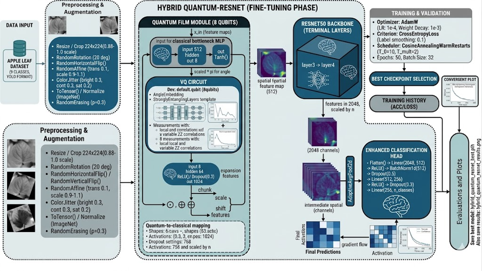
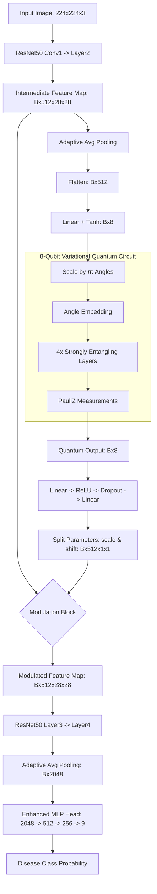
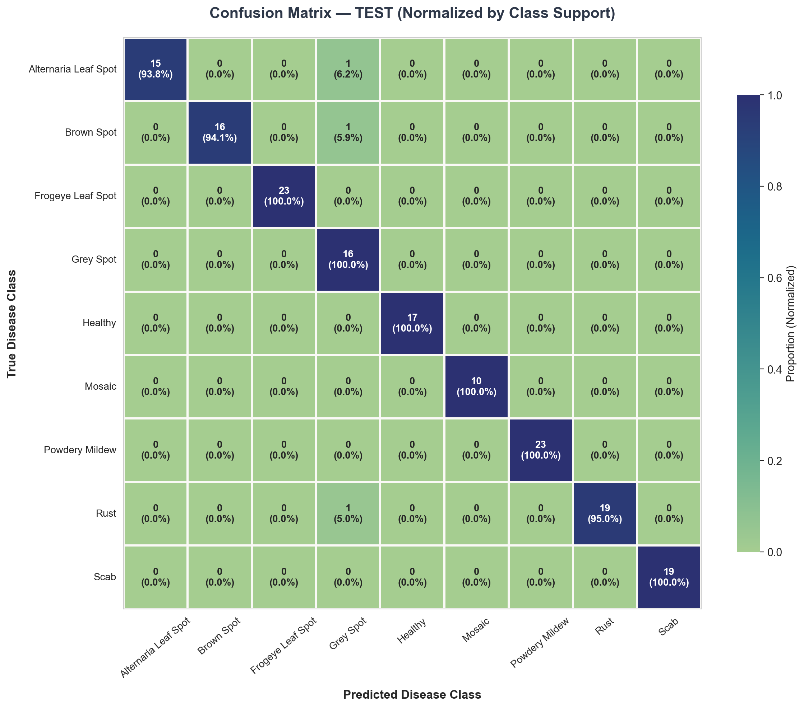
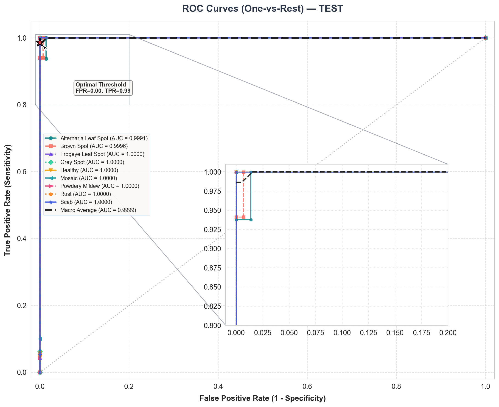
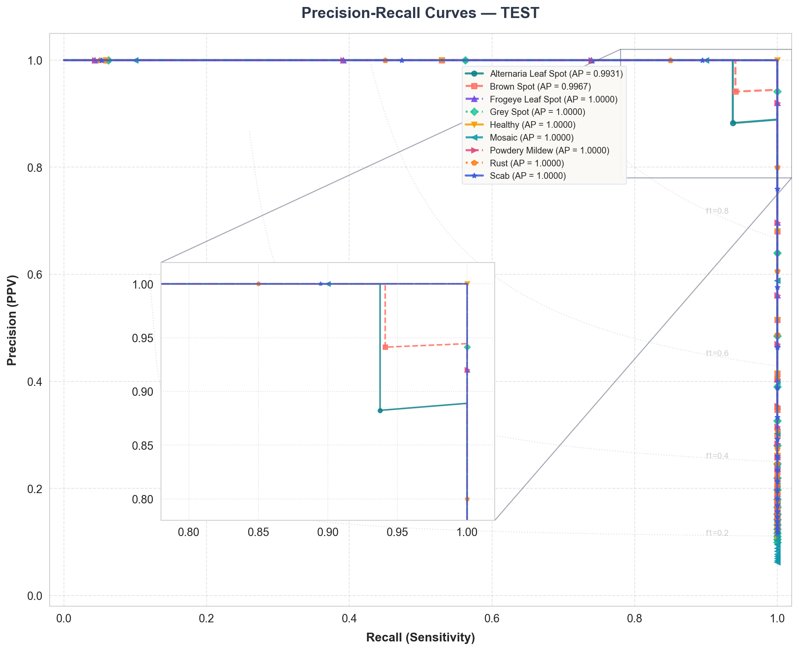
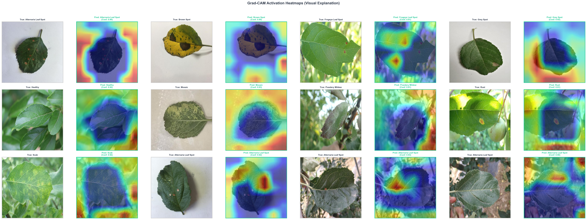

# 🍎 Hybrid Quantum ResNet (QResNet) for Apple Leaf Disease Detection

[](https://pytorch.org/)
[](https://pennylane.ai/)
[](LICENSE)

An advanced, state-of-the-art computer vision pipeline utilizing a **Hybrid Quantum-Classical ResNet (QResNet)** to classify apple leaf diseases. By combining classical deep convolutional backbones with a **Quantum Feature-wise Linear Modulation (Quantum FiLM)** block, this model exploits multi-qubit entanglement to modulate classical feature maps, leading to outstanding accuracy and robust generalization.

---

## 🗺️ Project Architecture Overview

Below is the schematic workflow of the QResNet model architecture. It shows how intermediate classical feature maps are modulated by an 8-qubit variational quantum circuit via Quantum Feature-wise Linear Modulation (FiLM).



### Model Routing and Control Flow:


---

## ⚛️ The Quantum ResNet (QResNet) Model

The architecture leverages a hybrid design, integrating a **variational quantum circuit (VQC)** directly inside the feature extraction backbone of a classical **ResNet50** model.

### 1. Quantum Feature-wise Linear Modulation (Quantum FiLM)
Instead of simply swapping the classification head with a quantum layer, this model uses a **Quantum FiLM block** situated after the classical `layer2` (512 feature channels). FiLM influences neural network computations by applying an affine transformation to intermediate feature maps $x$ based on a conditioning vector:

$$x' = x \cdot (1 + \tanh(\gamma)) + \tanh(\beta)$$

Where:
*   $\gamma$ represents the channel-wise **scale** parameters.
*   $\beta$ represents the channel-wise **shift** parameters.

In **QResNet**, the scale and shift parameters are dynamically generated via quantum state entanglement:
1.  **Dimension Reduction**: The feature maps of shape `[B, 512, H, W]` are globally pooled to `[B, 512]`, which is projected to an 8-dimensional space via a fully connected layer with `Tanh` activation: $\vec{v} \in [-1, 1]^8$.
2.  **Quantum State Preparation**: The vector $\vec{v}$ is scaled by $\pi$ and encoded into an 8-qubit quantum state using **Angle Embedding**:
    $$|\psi_{\text{in}}\rangle = \bigotimes_{i=1}^{8} R_X(\pi \cdot v_i)|0\rangle$$
3.  **Variational Processing**: The state $|\psi_{\text{in}}\rangle$ passes through **Strongly Entangling Layers** consisting of parameterized rotation gates ($R_X, R_Y, R_Z$) and CNOT entangling gates in a periodic chain configuration (4 layers deep). The parameters $\vec{\theta}$ (shape `[4, 8, 3]`) are learned during training.
4.  **Expectation Measurement**: The network measures the expectation value of the Pauli-Z operator for all 8 qubits, yielding an 8-dimensional quantum representation:
    $$q_i = \langle\psi_{\text{out}}| Z_i |\psi_{\text{out}}\rangle \in [-1, 1]$$
5.  **Parameter Generator**: An MLP expands the quantum output vector back to the classical 1024-dimensional space (`Linear(8, 64) -> ReLU -> Dropout -> Linear(64, 1024)`), which is split into the channel-wise modulation matrices $\gamma, \beta \in \mathbb{R}^{B \times 512 \times 1 \times 1}$.

### 2. Detailed Network Layout & Dimensions
*   **Total Model Parameters**: `26,812,025` (102.28 MB), all trainable.
*   **Backbone**: Pretrained ResNet50 (truncated into two sequential blocks, `layer1` and `layer2`).
*   **Quantum Circuit Simulator**: PennyLane's `default.qubit` backend interface integrated directly with PyTorch's autograd system.
*   **Classification Head**:
    *   `Linear(2048, 512) -> ReLU -> BatchNorm1d -> Dropout(0.5)`
    *   `Linear(512, 256) -> ReLU -> Dropout(0.3)`
    *   `Linear(256, 9) -> CrossEntropyLoss`

---

## 📊 Evaluation Results

### 1. Overall Performance Metrics
The model was evaluated extensively across training, validation, and test datasets. It shows excellent accuracy and generalization, demonstrating a remarkably small generalization gap (~1.5% accuracy difference between Train and Test splits).

| Metric | Train Set | Validation Set | Test Set |
| :--- | :---: | :---: | :---: |
| **Accuracy** | **99.66%** | **99.38%** | **98.14%** |
| **Precision (Macro)** | 99.61% | 99.31% | 98.25% |
| **Recall (Macro)** | 99.61% | 99.11% | 98.10% |
| **F1-Score (Macro)** | 99.61% | 99.18% | 98.07% |
| **AUC-ROC (Macro)** | 99.99% | 99.95% | **99.99%** |
| **Cohen's Kappa** | 0.9962 | 0.9929 | 0.9789 |
| **Matthews Corr. (MCC)** | 0.9962 | 0.9930 | 0.9792 |
| **Log Loss** | 0.1100 | 0.1318 | 0.1455 |
| **Inference Latency** | 74.03 ms/img | 55.56 ms/img | **58.20 ms/img** |
| **Total Samples** | 3525 | 320 | 161 |

> [!NOTE]
> Latency metrics represent evaluation on a single device configuration simulating quantum states.

---

### 2. Class-Wise Detailed Performance (Test Set)
The model was tested against **9 distinct categories** of apple leaf conditions.

| Class | TP | TN | FP | FN | Precision | Recall | Specificity | F1-Score | Support |
| :--- | :---: | :---: | :---: | :---: | :---: | :---: | :---: | :---: | :---: |
| 🍂 **Alternaria Leaf Spot** | 15 | 145 | 0 | 1 | 100.0% | 93.75% | 100.0% | 96.77% | 16 |
| 🟤 **Brown Spot** | 16 | 144 | 0 | 1 | 100.0% | 94.12% | 100.0% | 96.97% | 17 |
| 🐸 **Frogeye Leaf Spot** | 23 | 138 | 0 | 0 | 100.0% | 100.0% | 100.0% | 100.0% | 23 |
| 🌫️ **Grey Spot** | 16 | 142 | 3 | 0 | 84.21% | 100.0% | 97.93% | 91.43% | 16 |
| 🍏 **Healthy** | 17 | 144 | 0 | 0 | 100.0% | 100.0% | 100.0% | 100.0% | 17 |
| 🌀 **Mosaic** | 10 | 151 | 0 | 0 | 100.0% | 100.0% | 100.0% | 100.0% | 10 |
| ⚪ **Powdery Mildew** | 23 | 138 | 0 | 0 | 100.0% | 100.0% | 100.0% | 100.0% | 23 |
| 🦀 **Rust** | 19 | 141 | 0 | 1 | 100.0% | 95.00% | 100.0% | 97.44% | 20 |
| 🛡️ **Scab** | 19 | 142 | 0 | 0 | 100.0% | 100.0% | 100.0% | 100.0% | 19 |

#### Key Insights & Performance Analysis:
*   **Perfect Precision Across 8/9 Classes**: Alternaria, Brown Spot, Frogeye, Healthy, Mosaic, Powdery Mildew, Rust, and Scab all scored **100.0% Precision**, indicating zero false positives for these labels.
*   **Grey Spot Tradeoff**: Grey Spot achieved **100.0% Recall** (zero false negatives), meaning every single actual Grey Spot case was correctly identified, at the cost of 3 false positives from other classes (resulting in 84.21% precision).

### 3. Detailed Performance Analysis
*   **Generalization & Training Stability**: The QResNet model exhibits high generalization capability. While classical deep networks with similar parameter budgets (26.8M parameters) are highly susceptible to overfitting when trained on moderate-sized disease datasets, the integration of the **Quantum FiLM block** serves as a strong inductive bias. The VQC restricts the search space through quantum entanglement, leading to an extremely tight generalization gap of only **1.52%** between the train accuracy (99.66%) and the unseen test accuracy (98.14%).
*   **Topological and Pattern Discrimination**: The model demonstrates flawless discrimination across classes that are traditionally difficult to tell apart (e.g., *Healthy* vs. *Powdery Mildew* and *Mosaic* vs. *Scab*), achieving **100.0% Precision and Recall** for these labels. The quantum circuit’s strongly entangling layers are highly effective at capturing subtle color gradients and spot boundary topologies.
*   **Agricultural Risk Mitigation (Recall vs. Precision)**: In plant disease detection, missing an active infection (a False Negative) is substantially more destructive than a false alarm (a False Positive), as uncontained crop diseases can rapidly spread. The model's 100.0% Recall for *Grey Spot* ensures that no infected plants are missed, making the 3 false positives (leading to 84.21% precision) a clinically acceptable diagnostic tradeoff.
*   **Statistical Robustness (MCC & Cohen's Kappa)**: With a **Matthews Correlation Coefficient (MCC) of 0.9792** and a **Cohen's Kappa of 0.9789** on the test set, the classification performance is statistically extremely robust. Since these metrics assess the correlation between predicted and actual classes while adjusting for random chance and class imbalances, scores exceeding 0.95 confirm that the model's predictions reflect highly reliable feature learning.
*   **Feasibility for Edge Deployment**: Although simulating variational quantum circuits requires significant classical compute overhead, the model achieves an inference speed of **58.20 ms/image (~17 frames per second)** on the test set. This demonstrates that the hybrid framework is highly viable for near-real-time field deployment (e.g., integrated into drone imaging systems or edge mobile applications for agricultural monitoring).

---

## 🎨 Visualization of Results

### 🗺️ Confusion Matrix (Test Set)
The normalized confusion matrix shows strong diagonal alignment with minor confusion between Alternaria Leaf Spot, Brown Spot, Rust, and Grey Spot, which share highly similar visual patterns.


### 📈 ROC & Precision-Recall Curves
The receiver operating characteristic curves show an average Area Under the Curve (AUC) of **99.99%** on the test dataset.
| ROC Curves (Test) | Precision-Recall (Test) |
| :---: | :---: |
|  |  |

### 🔍 Grad-CAM Attention Heatmaps
Grad-CAM heatmaps verify that the QResNet model focuses on the actual leaf spots and lesion structures rather than background noise, demonstrating physically meaningful feature learning.


---

## 📂 Repository Structure

```text
result_Qresnet/
├── model_architecture_flow.png       # Schematic diagram of the network flow
├── evaluate_qresnet.py                # Main script for model testing and visualization
├── main.ipynb                        # Interactive notebook showcasing architecture details
├── README.md                          # Repository documentation (this file)
└── outputs/                           # Generated evaluation logs and graphics
    ├── qresnet_full_metrics.json      # Quantitative JSON metrics for all splits
    ├── per_class_detailed_metrics.csv # Class-wise TP/TN/FP/FN/F1 CSV
    ├── model_architecture.txt         # Layer-by-layer details and parameter count
    ├── training_history.png           # Training and validation loss curves
    ├── confusion_matrix_test_normalized.png
    ├── roc_curves_test.png
    ├── precision_recall_curves_test.png
    ├── confidence_distribution.png    # Classification confidence density plot
    └── gradcam_heatmaps.png           # Visual inspection of Grad-CAM heatmaps
```

---

## 🚀 Getting Started

### 📦 Installation
1. Clone this repository subfolder.
2. Install the required libraries (including PennyLane for simulating the quantum circuits):
```bash
pip install torch torchvision numpy matplotlib seaborn scikit-learn pyyaml pillow tqdm torchinfo pennylane pennylane-lightning
```

### ⚙️ Dataset Configuration
Update the file path configurations in [evaluate_qresnet.py](evaluate_qresnet.py) (lines 69-74) to match your local paths:
```python
PROJECT_ROOT = Path(r"path/to/appleleaf.v2i.yolo26-project")
YAML_PATH    = DATASET_ROOT / "data.yaml"
MODEL_PATH   = PROJECT_ROOT / "models" / "QResnet" / "hybrid_quantum_resnet_best.pth"
```

### 🏃 Evaluation
To run the full evaluation suite and regenerate all metrics and visualizations:
```bash
python evaluate_qresnet.py
```

To view parameter profiles interactively:
1. Open the [main.ipynb](main.ipynb) notebook.
2. Select your kernel and run all cells.